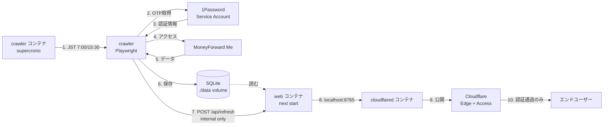

<div align="center">
  
  <h1>MoneyForward Me Dashboard</h1>
  <p>MoneyForward Meを自動化、可視化</p>
</div>

## 機能

### 指定した時間に金融機関の一括更新

crawler コンテナ内の supercronic で定期的に実行し、登録金融機関の「一括更新」ボタンを押し監視を行う。デフォルトの設定は、毎日 7:00 (JST) と 15:30 (JST)。

### Slackへ結果を投稿

Slack botの設定をすることにより、前日との差分を投稿可能。


### 自分の行いたい処理を実行

hookが提供されているので、スクレイピング時に用意したスクリプトを実行可能。例えば、特定の金融機関の取引の場合に大項目、中項目を常に食品に設定する等。Playwrightの`Page`を持っているので基本何でもできる。

### MCP経由でAIアシスタントと連携

MCP (Model Context Protocol) サーバーを内蔵。ChatGPTやClaude Desktopから、家計・資産・投資データを自然言語で照会できる。詳細は [apps/mcp/README.md](apps/mcp/README.md) を参照。

### すべての情報を可視化

[demoページ](https://hiroppy.github.io/mf-dashboard)を参考。予算機能以外はすべて対応済み。


### 複利シミュレーター

いくら積み立てて、いくら切り崩しをすればいいのかモンテカルロ法を用いて計算。年金なども設定でき、精度高く検証する。

[個別サイト](https://asset-melt.party/)

## 導入方法

[使い方ページ](/docs/setup.md)を参照

## アーキテクチャ

ローカル PC で **Docker Compose** を使い、`web` (Next.js) / `cloudflared` / `crawler` の 3 サービスを常駐させる。crawler コンテナは内部に **supercronic** (containers 向けの cron) を持ち、JST 7:00 / 15:30 に MoneyForward をスクレイピング → 完了後 web の `/api/refresh` を Docker bridge 経由で叩いて `revalidatePath` で全ルートを再生成する。SQLite は volume 経由で web/crawler が共有し、Git には commit しない。外部公開は Cloudflare Tunnel + Access (Google IdP + email allowlist)。



**処理の流れ:**

- **常駐**: Docker Desktop の自動起動 + `restart: unless-stopped` で 3 コンテナがホスト起動時に立ち上がる
- **スケジューリング**: crawler コンテナの supercronic が `docker/crawler/crontab` を回す (TZ=Asia/Tokyo)
- **データ取得**: Playwright で MoneyForward Me からスクレイピング
- **認証**: 1Password Service Account から OTP を取得
- **データ保存**: 共有 volume の SQLite (`./data/moneyforward.db`) に保存
- **静的再生成**: crawler 完了後、web コンテナの `/api/refresh` を Docker bridge 経由で POST → `revalidatePath('/', 'layout')` で全ルートを invalidate。次のリクエストで新しい DB の内容を反映 (`expose:` のみで host には公開しないので外部到達不可)
- **公開**: cloudflared コンテナが Cloudflare Edge と接続し、Access (Google IdP + email allowlist) を経由して許可ユーザーのみアクセス可能

Cloudflare 側の Tunnel / DNS / Access は `terraform/` で宣言的に管理する。詳細は [docs/setup.md](/docs/setup.md) を参照。

## 推奨セキュリティ

- GitHub
  - Passkey
- MoneyForward Me
  - ワンタイムパスワード
  - Passkeyだけだとクローリングするときにログインできない点に注意
- Cloudflare
  - Cloudflare Tunnel + Access (Zero Trust) で Google ログイン + email allowlist によるアクセス制限

## 開発

[UIコンポーネント集](https://hiroppy.github.io/mf-dashboard/storybook/)

```sh
$ git clone xxx
$ cd mf-dashboard
# demoで確認したいだけであれば不要
$ cp .env.example .env
$ pnpm i
# demoデータで確認
$ pnpm dev:demo
# 実際のアカウントのデータを取得する場合
$ pnpm db:dev
$ pnpm dev
```

## 更新

```sh
$ sh update.sh
```
