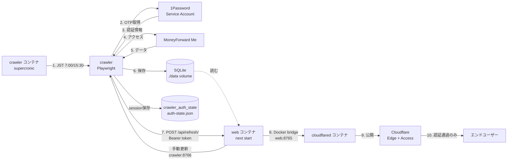

<div align="center">
  
  <h1>MoneyForward Me Dashboard</h1>
  <p>MoneyForward Meを自動化、可視化</p>
</div>

## 機能

### 指定した時間に金融機関の一括更新

crawler コンテナ内の supercronic で定期的に実行し、登録金融機関の「一括更新」ボタンを押し監視を行う。デフォルトの設定は、毎日 7:00 (JST) と 15:30 (JST)。

### Slackへ結果を投稿

Slack botの設定をすることにより、前日との差分を投稿可能。


### 自分の行いたい処理を実行

hookが提供されているので、スクレイピング時に用意したスクリプトを実行可能。例えば、特定の金融機関の取引の場合に大項目、中項目を常に食品に設定する等。Playwrightの`Page`を持っているので基本何でもできる。

### 未分類取引のカテゴリを自動決定

`data/category-rules.json` を置くと、MoneyForwardから取得した新規の未分類取引に対して固定ルールを優先適用し、必要に応じてLLM推論へfallbackできる。決定したカテゴリはMoneyForward側へ反映し、対象月を再取得してDBに保存する。設定方法は [docs/setup.md](docs/setup.md#未分類取引のカテゴリ決定) を参照。

### MCP経由でAIアシスタントと連携

MCP (Model Context Protocol) サーバーを内蔵。ChatGPTデスクトップアプリ、Codex、Claude Desktop、Claude Codeから、家計・資産・投資データを自然言語で照会できる。詳細は [apps/mcp/README.md](apps/mcp/README.md) を参照。

### すべての情報を可視化

[demo](https://mf-dashboard-demo.vercel.app/) データで確認できる。予算機能以外はすべて対応済み。


### 複利シミュレーター

いくら積み立てて、いくら切り崩しをすればいいのかモンテカルロ法を用いて計算。年金なども設定でき、精度高く検証する。

[個別サイト](https://asset-melt.party/)

## 導入方法

[使い方ページ](docs/setup.md)を参照

## アーキテクチャ

ローカル PC で **Docker Compose** を使い、`web` (Next.js) / `cloudflared` / `crawler` の 3 サービスを常駐させる。crawler コンテナは内部に **supercronic** (containers 向けの cron) と手動更新 API を持ち、JST 7:00 / 15:30 または UI の更新ボタンから MoneyForward をスクレイピング → 完了後 web の `/api/refresh/` を Docker bridge 経由で Bearer 認証付き POST し、`revalidatePath` で全ルートを再生成する。SQLite は volume 経由で web/crawler が共有し、Git には commit しない。外部公開は Cloudflare Tunnel + Access (Google IdP + email allowlist)。


```mermaid
graph LR
    A[crawler コンテナ<br/>supercronic] -->|1. JST 7:00/15:30| B[crawler<br/>Playwright]
    W -->|手動更新<br/>crawler:8766| B
    B -->|2. OTP取得| E[1Password<br/>Service Account]
    E -->|3. 認証情報| B
    B -->|4. アクセス| F[MoneyForward Me]
    F -->|5. データ| B
    B -->|6. 保存| C[(SQLite<br/>./data volume)]
    B -->|session保存| K[(crawler_auth_state<br/>auth-state.json)]
    C -.読む.-> W[web コンテナ<br/>next start]
    B -->|7. POST /api/refresh/<br/>Bearer token| W
    W -->|8. Docker bridge<br/>web:8765| H[cloudflared コンテナ]
    H -->|9. 公開| I[Cloudflare<br/>Edge + Access]
    I -->|10. 認証通過のみ| J[エンドユーザー]
```

**処理の流れ:**

- **常駐**: Docker Desktop の自動起動 + `restart: unless-stopped` で 3 コンテナがホスト起動時に立ち上がる
- **スケジューリング**: crawler コンテナの supercronic が `docker/crawler/crontab` を回す (TZ=Asia/Tokyo)。web の更新ボタンから内部 API 経由でも即時実行できる
- **データ取得**: Playwright で MoneyForward Me からスクレイピング
- **認証**: 1Password Service Account から OTP を取得
- **データ保存**: 共有 volume の SQLite (`./data/moneyforward.db`) に保存。MoneyForward の browser session は crawler 専用 volume に分離し、web から mount しない
- **静的再生成**: crawler 完了後、web コンテナの `/api/refresh/` を Docker bridge 経由で Bearer 認証付き POST → `revalidatePath('/', 'layout')` で全ルートを invalidate。次のリクエストで新しい DB の内容を反映 (`expose:` のみでhost portには直接公開せず、外部アクセスはCloudflare Access経由に限定)
- **公開**: cloudflared コンテナが Cloudflare Edge と接続し、Access (Google IdP + email allowlist) を経由して許可ユーザーのみアクセス可能

Cloudflare 側の Google IdP / Tunnel / DNS / Access は `terraform/` で宣言的に管理する。アプリ設定は `.env`、Cloudflare API Token・Google OAuth client・公開先・Access allowlist などのインフラ設定は gitignore 済みの `terraform/terraform.tfvars` に分離する。Terraform が生成した Tunnel token は app 共有 data volume とは別の `secrets/cloudflared-token` を介して Compose secret として cloudflared に渡す。

本番向けのセットアップでは Terraform を適用してから Docker Compose を起動する。必要な設定と Google OAuth client の準備手順は [docs/setup.md](docs/setup.md) を参照。

## 推奨セキュリティ

- GitHub
  - Passkey
- MoneyForward Me
  - ワンタイムパスワード
  - Passkeyだけだとクローリングするときにログインできない点に注意
- Cloudflare
  - Cloudflare Tunnel + Access (Zero Trust) で Google ログイン + email allowlist によるアクセス制限

## 開発

UIコンポーネント集は `pnpm --filter @mf-dashboard/web storybook` で確認する。

Storybook story 必須対象: `apps/web/src/components/` 配下の再利用 UI component は
同階層に `*.stories.tsx` を置く。例外は `.client.tsx`、context/provider、hook、types、
および親 component の story で直接検証される実装専用 component に限る。

```sh
$ git clone xxx
$ cd mf-dashboard
$ pnpm i
# demoデータで確認
$ pnpm dev:demo
# 実際のアカウントのデータを取得する場合
$ cp .env.example .env
# .env の OP_SERVICE_ACCOUNT_TOKEN / OP_VAULT / OP_ITEM / OP_TOTP_FIELD を設定
$ pnpm db:dev
$ pnpm dev
```

local 開発では `DB_PATH` と `WEB_URL` を未設定のままにする。`DB_PATH` は repo root の
`data/moneyforward.db` に自動解決され、`WEB_URL` 未設定時は crawler 完了後の web refresh
通知を skip する。Docker Composeでは `compose.yml` が `WEB_URL=http://web:8765` と crawler 専用の `AUTH_STATE_PATH=/app/crawler-state/auth-state.json` を設定する。Linux host で `./data` に書き込めない場合は `.env` の `HOST_UID` / `HOST_GID` を host user に合わせる。

`data/demo.db` は生成物として扱い、Git には含めない。`pnpm dev:demo` / `pnpm build:demo`
実行時に自動生成される。手動で作り直したい場合は次を実行する。

```sh
$ pnpm --filter @mf-dashboard/db build:demo
```
