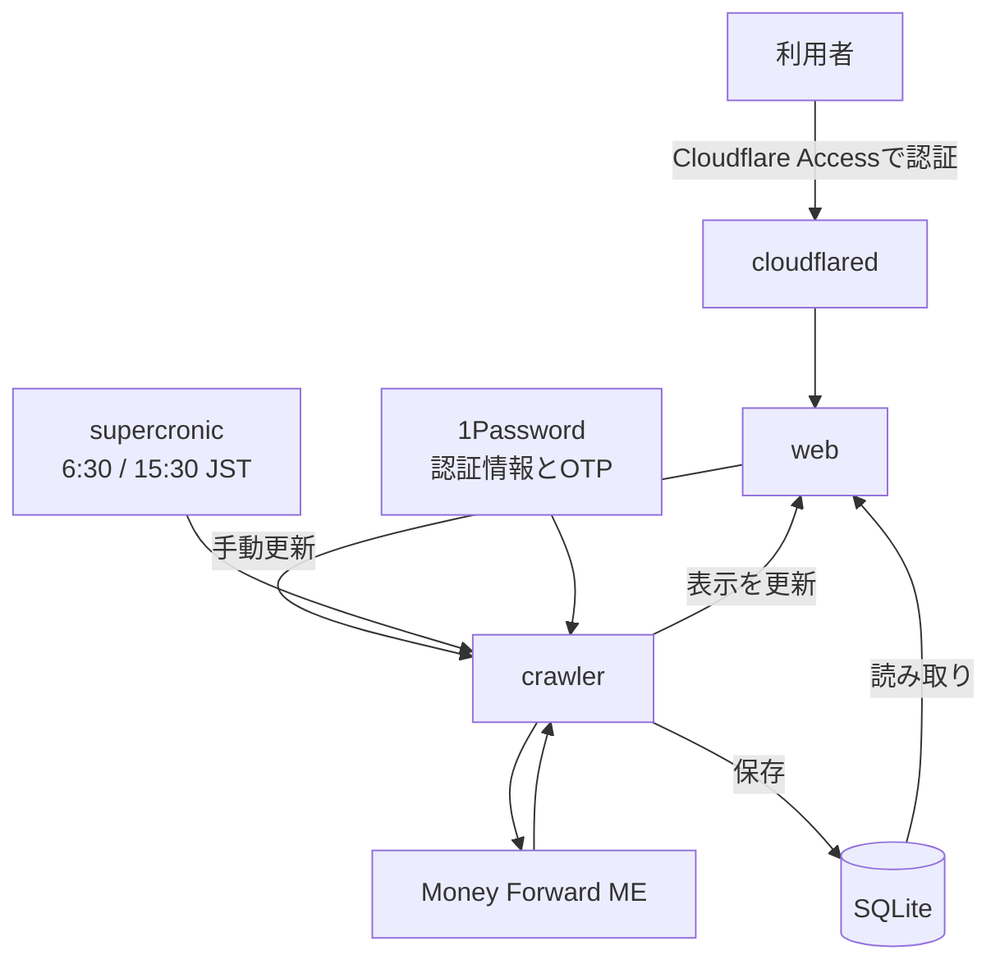

  
  <h1>MoneyForward Me Dashboard</h1>
  
Money Forward MEのデータ取得・更新・可視化を自動化するダッシュボード

Money Forward MEの家計・資産・投資データを定期的に取得し、Webダッシュボードで確認できる。更新結果の通知、取引カテゴリの自動決定、AIアシスタントからのデータ照会にも対応する。

[デモを見る](https://mf-dashboard-demo.vercel.app/) · [本番環境をセットアップする](docs/setup.md)

## 本番環境へ導入する

本番環境では、ローカルPC上のDocker ComposeでWeb、crawler、Cloudflare Tunnelを常時稼働させる。Money Forward ME、1Password Service Account、Cloudflare Zero Trustの準備が必要になる。

設定値の作成から起動後の確認まで、[セットアップガイド](docs/setup.md)に沿って進める。

## 主な機能

### 金融機関の情報を自動更新

crawlerコンテナ内のsupercronicが、登録金融機関の「一括更新」を定期的に実行して完了を監視する。既定の実行時刻は毎日6:30と15:30（JST）。ダッシュボードから手動でも実行できる。

### 更新結果をSlackやDiscordへ通知

通知先を設定すると、更新結果や前日との差分をSlackまたはDiscordへ投稿できる。

### スクレイピング処理をフックで拡張

スクレイピング中に独自のスクリプトを実行できる。Playwrightの`Page`を利用し、特定の条件に一致する取引のカテゴリ変更など、ブラウザ上の処理を追加できる。

### 未分類取引のカテゴリを自動決定

`data/category-rules.json`を用意すると、新規の未分類取引へ固定ルールを適用できる。ルールに一致しない取引には、任意でLLMによる推論も利用できる。決定したカテゴリはMoney Forward MEへ反映し、対象月を再取得してデータベースへ保存する。

[カテゴリ決定機能を設定する](docs/setup.md#未分類取引のカテゴリ決定)

### 家計AIチャットで家計データを照会

Webアプリ右下の家計AIチャットから、家計・資産・投資データを自然言語で照会できる。チャットは現在のデータベーススキーマを参照し、選択中のグループに対してread-only SQLだけを実行する。利用するには`.env`へ`AI_PROVIDER`、`AI_MODEL`、`AI_API_KEY`を設定する。デモデータでチャットを試す場合の起動方法は[家計AIチャットの設定](docs/setup.md#家計aiチャット)を参照。

セットアップガイドでは、対応プロバイダー、Docker Composeでの起動方法、外部送信されるデータ、エラー時の確認事項も説明する。

従来のMCPサーバーとAIクライアント側のMCPセットアップは廃止した。家計データの照会にはWebアプリ内の家計AIチャットを使用する。

### 家計・資産情報を可視化

予算機能を除くダッシュボードの表示を、[公開デモ](https://mf-dashboard-demo.vercel.app/)で確認できる。

| 月次画面                                                                     | ダッシュボード                                                                             |
| ---------------------------------------------------------------------------- | ------------------------------------------------------------------------------------------ |
|  |  |

### 複利シミュレーション

積立額や取崩額、年金などの条件を設定し、モンテカルロ法で資産推移をシミュレーションできる。[公開サイト](https://asset-melt.party/)でも利用可能。

## システム構成

Docker Composeで次の3サービスを動かす。

- **web**: SQLiteのデータを表示するNext.jsアプリ
- **crawler**: Money Forward MEからデータを取得し、SQLiteへ保存するPlaywrightアプリ
- **cloudflared**: Cloudflare Tunnelへ接続し、認証済みユーザーへWebアプリを公開

```mermaid
flowchart TD
    U[利用者] -->|Cloudflare Accessで認証| T[cloudflared]
    T --> W[web]
    W -->|手動更新| C[crawler]
    S[supercronic<br/>6:30 / 15:30 JST] --> C
    O[1Password<br/>認証情報とOTP] --> C
    C --> M[Money Forward ME]
    M --> C
    C -->|保存| D[(SQLite)]
    D -->|読み取り| W
    C -->|表示を更新| W
```

SQLiteはwebとcrawlerで共有する。外部アクセスはCloudflare TunnelとAccessで保護し、Googleログインとメールアドレスの許可リストを通過したユーザーだけに限定する。詳しい構築手順は[セットアップガイド](docs/setup.md)を参照。

## セキュリティ上の推奨事項

- Money Forward MEではワンタイムパスワードを有効にする
- Cloudflare AccessでGoogleログインとメールアドレスの許可リストを設定する

Money Forward MEでパスキーだけを設定するとcrawlerからログインできないため、ワンタイムパスワードも利用する。
